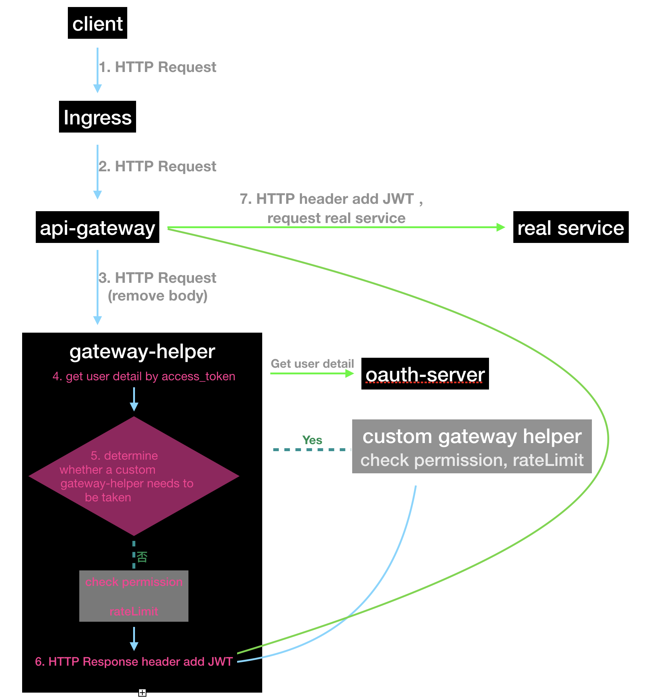

# API Gateway
The gateway service is responsible for routing requests to real services. Pulling configuration information including routes from `config-server `to implement dynamic routing. After requesting to remove the request body, it is forwarded to `gateway-helper` for authentication, traffic restrictions.

## Feature
- In the future, spring cloud zuul may be deprecated and `linkerd` or other gateway services may be used.

## Requirements
- The service is an eureka client service. The local operation needs to cooperate with `eureka-server`, and the online operation needs to cooperate with `go-register-server`.
- It needs to cooperate with `gateway-helper` to complete the gateway functions such as authentication, traffic restrictions, and routing.

## Installation and Getting Started
- Start `eureka-server`
- Go to the project directory， run `mvn spring-boot:run`

## Dependencies
- `go-register-server`:   The registration of service.
- `config-server`：The configuration of service

## Links

* [Change Log](./CHANGELOG.zh-CN.md)

## How to Contribute
Pull requests are welcome! [Follow](https://github.com/choerodon/choerodon/blob/master/CONTRIBUTING.md) to know for more information on how to contribute.

## Note
- It needs to cooperate with `gateway-helper` to complete the gateway functions such as authentication, traffic restrictions and routing.
